# AWS Config Compliance Monitoring & S3 Misconfiguration Remediation Lab

## Project Overview

This project demonstrates how AWS Config can be used to monitor cloud resources, detect security misconfigurations, and validate remediation actions. In this lab, an Amazon S3 bucket was intentionally misconfigured to trigger an AWS Config compliance violation. The issue was then remediated and verified through AWS Config.

---

## Objectives

- Configure and use AWS Config for compliance monitoring.
- Create and monitor an Amazon S3 bucket.
- Simulate a security misconfiguration.
- Detect compliance violations using AWS Config.
- Remediate the security issue.
- Verify that the resource returns to a compliant state.

---

## Services Used

- AWS Config
- Amazon S3
- AWS IAM

---

## Lab Architecture

```text
Amazon S3 Bucket
       │
       ▼
 AWS Config Monitoring
       │
       ▼
 Compliance Evaluation
       │
       ▼
 Noncompliant Finding
       │
       ▼
    Remediation
       │
       ▼
 Compliance Restored
```

---

## Steps Performed

### 1. AWS Config Verification

Verified that AWS Config was enabled and actively recording resource configurations within the AWS account.

### 2. Created an S3 Bucket

Created a new Amazon S3 bucket for testing compliance monitoring and security controls.

### 3. Configured Bucket Security

Applied security settings including:

- Server-side encryption
- Default security configurations
- Bucket monitoring through AWS Config

### 4. Introduced a Security Misconfiguration

Disabled Block Public Access settings on the S3 bucket to simulate an insecure cloud storage configuration.

### 5. AWS Config Detection

AWS Config evaluated the bucket configuration and identified the resource as noncompliant based on the configured compliance rule.

### 6. Investigated the Finding

Reviewed AWS Config compliance results and confirmed the bucket was flagged due to public access exposure.

### 7. Remediation

Re-enabled Block Public Access settings on the S3 bucket to restore secure configuration.

### 8. Compliance Verification

AWS Config re-evaluated the resource and confirmed the bucket returned to a compliant state.

---

## Security Findings

### Identified Risk

- Public access protections were disabled on the S3 bucket.
- This could potentially expose sensitive data if public permissions were granted.

### Remediation Action

- Re-enabled Block Public Access settings.
- Validated remediation through AWS Config compliance checks.

---

## Results

- Successfully detected an S3 security misconfiguration.
- Demonstrated AWS Config compliance monitoring capabilities.
- Performed remediation of a noncompliant resource.
- Verified compliance restoration after remediation.
- Gained hands-on experience with cloud governance and security monitoring.

---

## Key Skills Demonstrated

- AWS Config
- Cloud Security Monitoring
- Security Compliance Validation
- Amazon S3 Security
- Risk Identification
- Security Remediation
- Cloud Governance
- AWS Security Best Practices

### 📊 Evidence 

<h4 align="center">I started the lab by accessing AWS Config and initiating the setup process</h4>

<p align="center">
    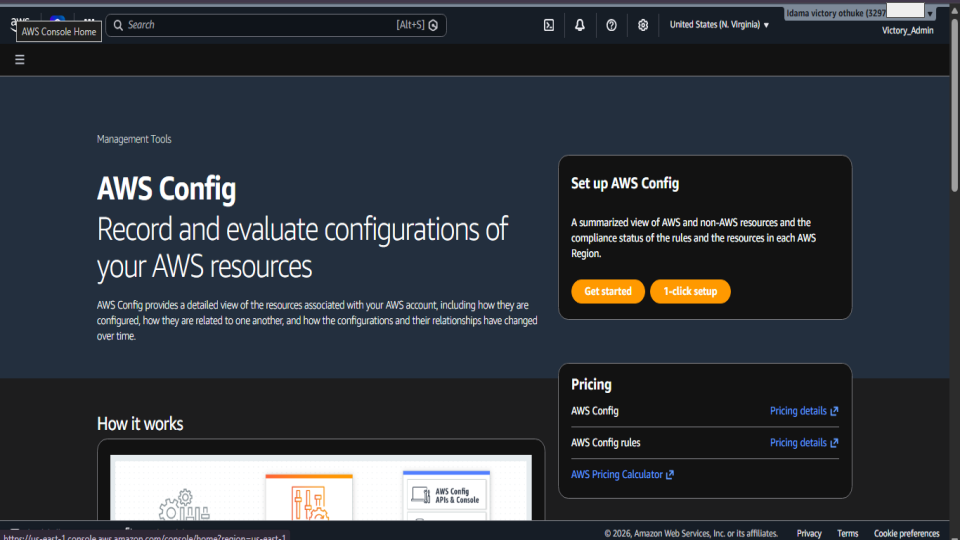
</p>

<h4 align="center">I selected the AWS managed rule s3-bucket-public-read-prohibited, which checks whether S3 buckets allow public read access</h4>

<p align="center">
    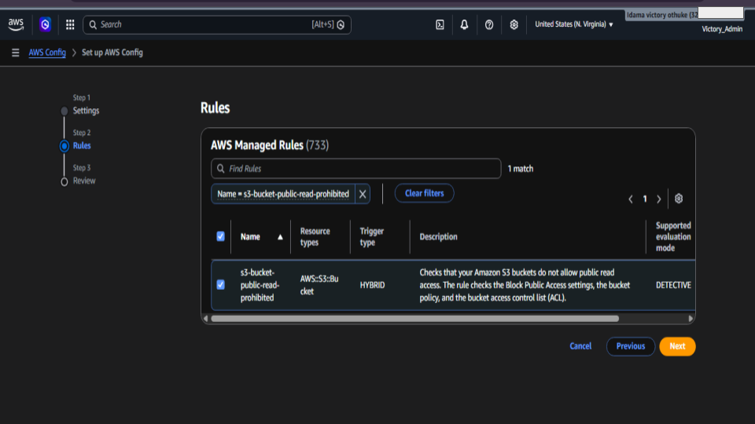
</p>

<h4 align="center">I verified that AWS Config was successfully configured and actively monitoring resources in my AWS environment</h4>

<p align="center">
    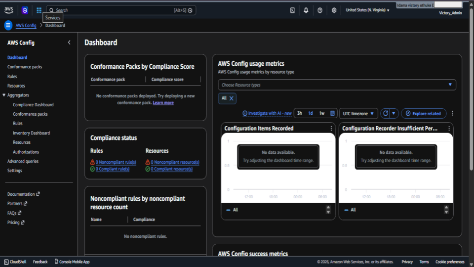
</p>

<h4 align="center">I created an Amazon S3 bucket named victory-config-test-2026 to use as the test resource for this AWS Config compliance lab</h4>

<p align="center">
    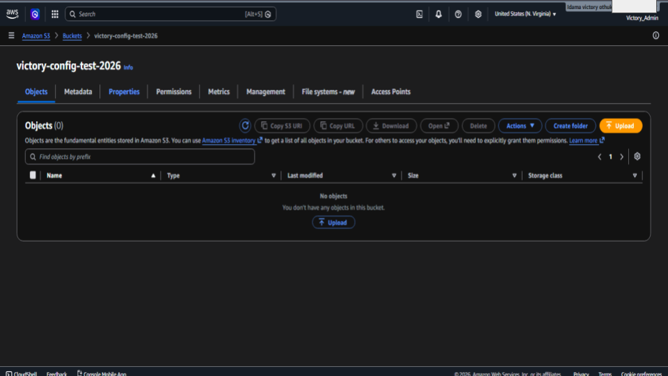
</p>

<h4 align="center">I intentionally disabled the S3 Block Public Access setting on the test bucket to simulate a security misconfiguration</h4>

<p align="center">
    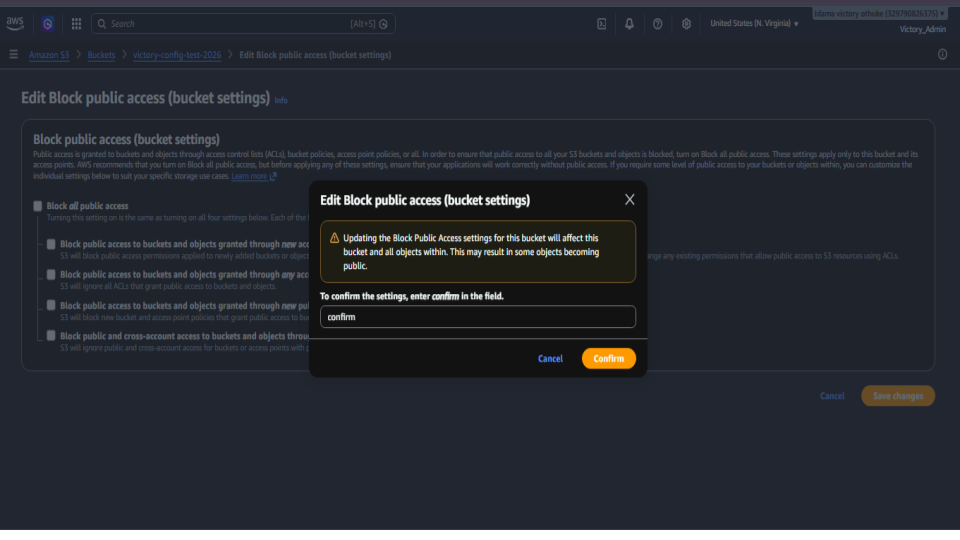
</p>

<h4 align="center">I successfully disabled the Block Public Access setting on the S3 bucket to create a deliberate security misconfiguration.</h4>

<p align="center">
    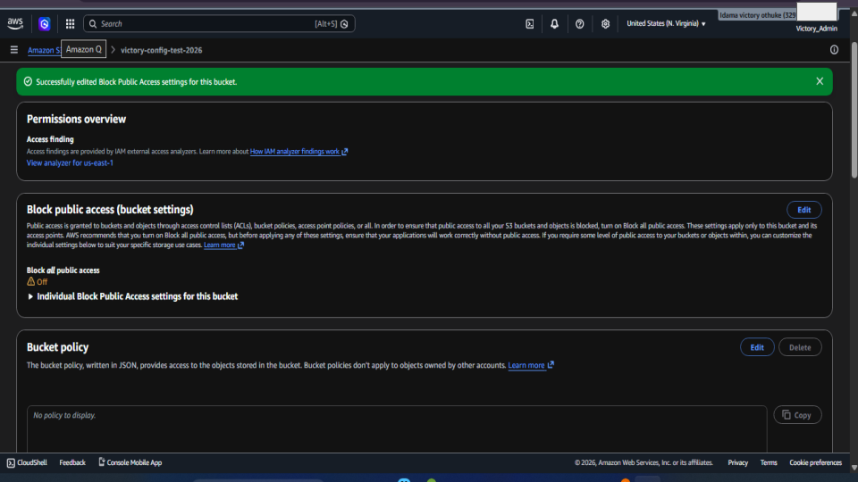
</p>

<h4 align="center">I monitored the AWS Config dashboard after creating the misconfiguration. The dashboard detected the S3 bucket as non-compliant with the s3-bucket-public-read-prohibited rule and displayed one non-compliant resource</h4>

<p align="center">
    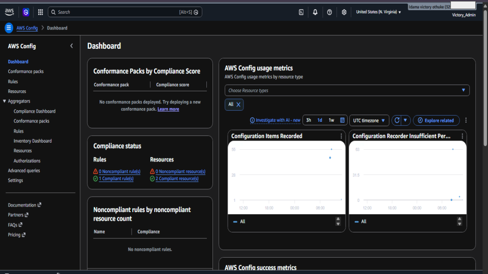
</p>

<h4 align="center">I created a bucket policy that allowed public read access to objects stored in the S3 bucket. This policy granted the s3:GetObject permission to all users by using the wildcard principal (*)</h4>

<p align="center">
    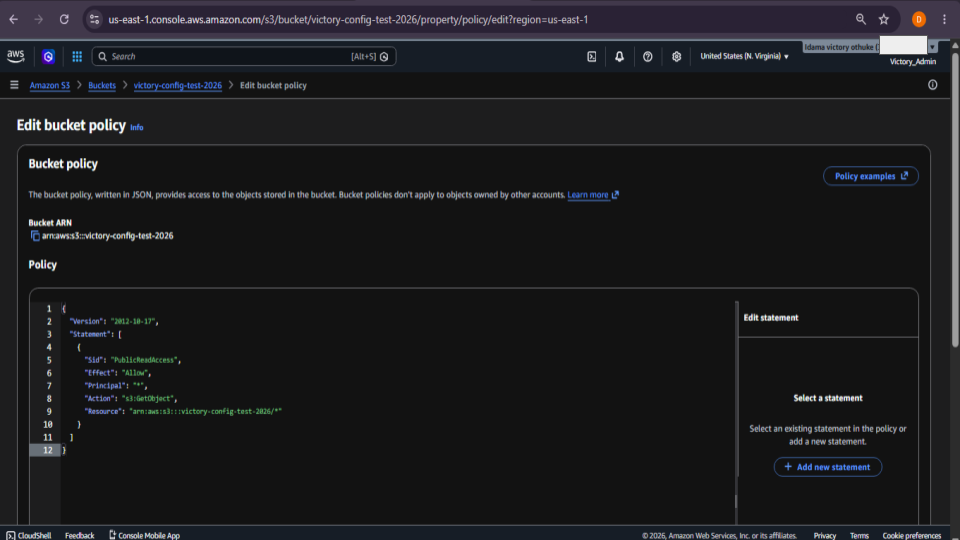
</p>

<h4 align="center">After applying the public access configuration, I returned to the AWS Config dashboard to verify the result. AWS Config successfully evaluated the S3 bucket against the s3-bucket-public-read-prohibited rule and identified it as non-compliant.</h4>

<p align="center">
    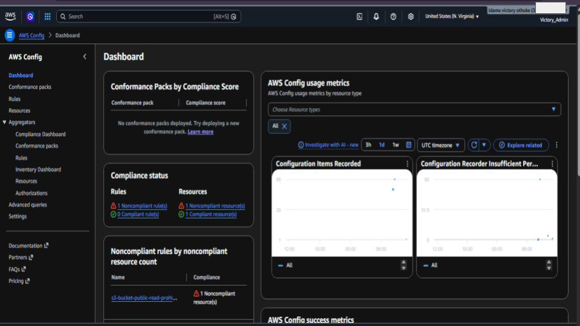
</p>


<h4 align="center">To remediate the security issue, I re-enabled the S3 Block Public Access settings on the bucket. This action prevented public access to bucket objects and restored the bucket to a secure configuration.</h4>

<p align="center">
    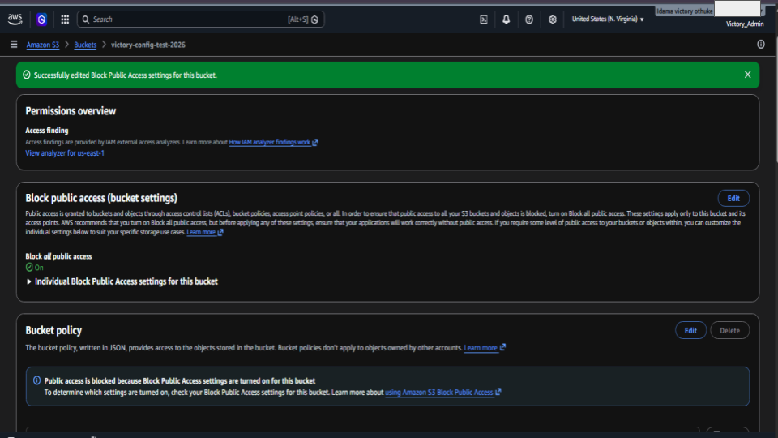
</p>


<h4 align="center">After re-enabling the Block Public Access settings, I returned to the AWS Config dashboard to verify the remediation. AWS Config re-evaluated the S3 bucket and confirmed that the security issue had been resolved</h4>

<p align="center">
    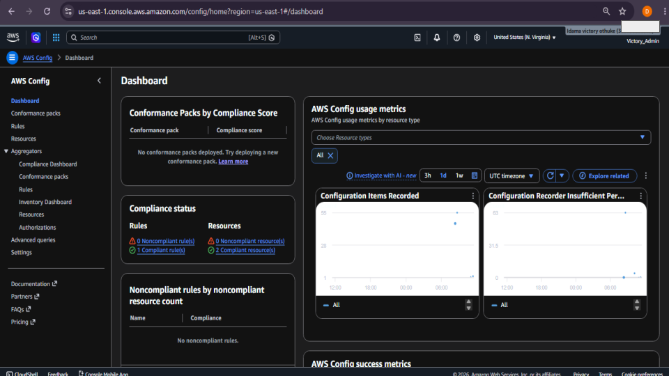
</p>


All screenshots are here:

🔗 [Google Slides](https://docs.google.com/presentation/d/1Rt1JE9BAPBYtq3Vxxezr9V4pXTTSMfVXDFVMoJ67LEg/edit?usp=sharing)

> Note: Sensitive account information was blurred for security purposes before publication.

## Conclusion

This lab demonstrates the complete cloud security workflow of monitoring, detecting, investigating, remediating, and validating security issues using AWS Config. The project highlights the importance of continuous compliance monitoring and secure cloud storage configurations in AWS environments.

## Author
Idama Victory Othuke
